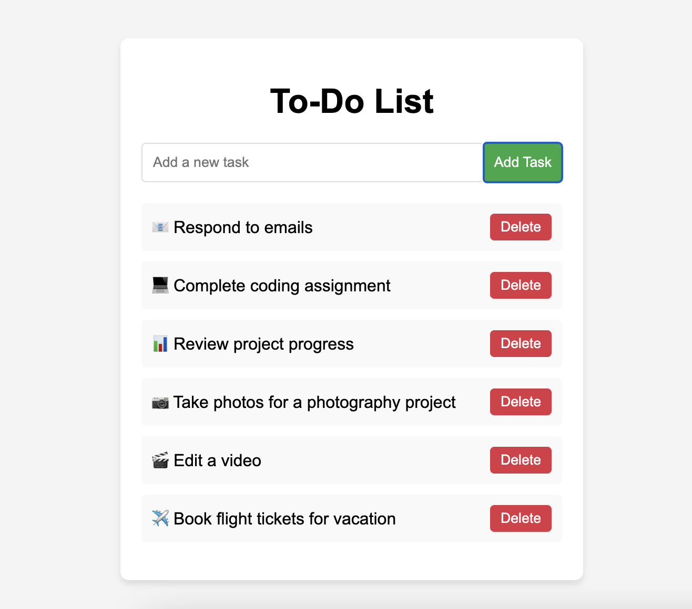

# 📝 To-Do List
A simple to-do list application to manage tasks, built with HTML, CSS, and JavaScript. It allows users to add, remove, and mark tasks as completed. The tasks are saved in the browser's localStorage so they persist even after the page is reloaded.

## 🚀 Features
- ✅ **Add tasks**: Easily add tasks to your to-do list.
- 🗑️ **Delete tasks**: Remove tasks from the list with a click of a button.
- ✔️ **Mark tasks as completed**: Click on a task to mark it as completed.
- 💾 **Save tasks**: Tasks are saved in the browser’s localStorage so they are persistent across page reloads.

## 💻 Technologies Used
- **HTML**: Structure of the web page.
- **CSS**: Styling and layout for the application.
- **JavaScript**: Functionality for adding, deleting, and marking tasks as completed. Also, stores tasks in localStorage.

## 🛠️ Installation
1. **Clone the repository**:
   ```bash
   git clone https://github.com/saleh-coder/ToDo-List.git
   ```

2. **Navigate to the project folder**:
   ```bash
   cd ToDo-List
   ```

3. **Open the project**:
   - Open the project in your favorite code editor (e.g., Visual Studio Code).
   - Alternatively, you can open the `index.html` file directly in a browser to see the project in action.

## 🖥️ Usage
1. **Open `index.html`** in your browser.
2. Add tasks to your to-do list using the input field and the "Add Task" button.
3. Mark tasks as completed by clicking on them.
4. Delete tasks by clicking the "Delete" button next to them.
5. Tasks will be saved in `localStorage`, so they persist even after a page refresh.

## 📸 Screenshots


## 🤝 Contributing
Feel free to fork this repository, open issues, and submit pull requests if you want to improve the project.

### Steps to contribute:
1. 🍴 Fork this repository.
2. 🌿 Create a new branch (`git checkout -b feature/your-feature`).
3. ✏️ Make your changes.
4. 📝 Commit your changes (`git commit -am 'Add your feature'`).
5. ⬆️ Push to your branch (`git push origin feature/your-feature`).
6. 🔀 Open a pull request.

## 📜 License
This project is open-source and available under the MIT License.

## 🙏 Acknowledgements
- 💾 **localStorage** for task persistence.
- 🌐 **HTML5, CSS3, and JavaScript** for the core technologies used in this app.
```